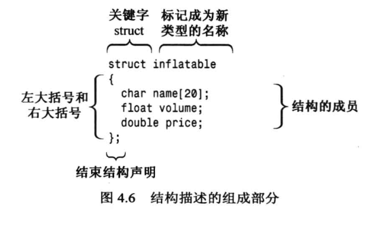
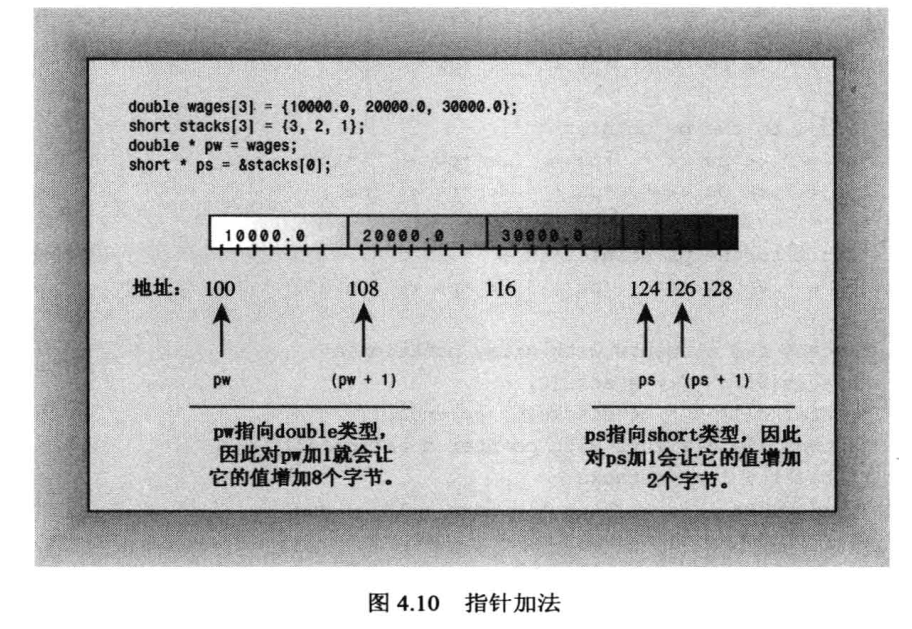
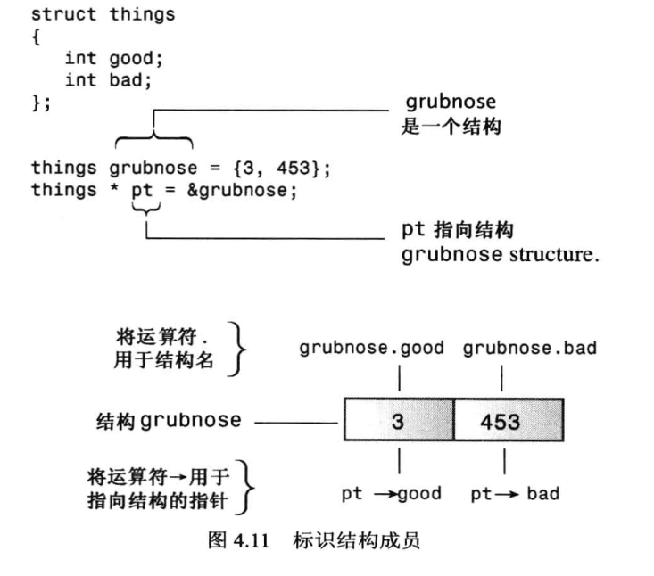

# 复合类型
## 数组array
- 存储相同类型的值
- 声明指出每个元素值类型，数组名和数组中元素数(必须为编译时已知整型常数，const值，常量亮表达式)：typeName arrayName[arraySize];
- 使用下标或索引单独访问数组元素（必须从0开始）
- 初始化
    - 初始化列表（花括号内逗号分隔, c++11时=可省略）: int yamcosts[3] = {20, 30, 5};
    - 只有定义数组时才能初始化，hand[4] = {5,6,7,8}不允许，hand = cards也不允许
    - 提供的值少于数组中元素树木则只对前面一部分初始化，其他元素置零： long totals[500] = {0};
    - 如果初始化时方括号为空，编译器计算元素个数： short things[] = {1,5,3,8};
    - c++11如果大括号为空则所有元素被置零
    - 列表初始化禁止缩窄
- sizeof 数组名得到整个数组的字节数

## 字符串(存储在内存连续字节中的一系列字符)
- c-style string
    - 只有结尾写作空字符\0的char数组才是字符串
    - 双引号括起来的字符串常量自动包含末尾空字符： char bird[] = "Mr. Cheeps";
    - char数组需要够大来存储结尾空字符
    - c++允许拼接字符串字面值，即将两个双引号括起来的字符串合并为一个：cout << "I'd give my right arm to be" " a great violinist. \n";
    - 列表初始化char first_data[]{"The Elegant Plate"};

- cin
    - 使用空白（空格、制表符和换行符）来确定字符串的结束位置
    - cin会把读取的字符串放到数组中并自动在结尾添加空字符
    - 无法避免读取的字符串比数组长
    - cin.getline(数组名，字符数+1)，使用更简单，以换行符或指定字符数确认结尾，保存时自动填充空字符
    - cin.get(name, ArSize), 检查错误更方便，调用后换行符会留在队列中，需要使用cin.get()读取下一个字符为读取下一行做准备
    - get()读取空行后将设置失效位，需要使用cin.clear()恢复
    - 输入字符串比分配空间长，getline()和get()会把剩下字符留在队列中，getline()会设置失效位
    - cin读取数字会把换行符留在队列中，
## String
- 程序可以自动处理string的大小
- 列表初始化： string third_data {"Hank's Fine Eats"};
- 数组不可以赋值给另一个数组，但是string可以赋值给另一个string
- 可以使用+, +=合并字符串
- 在没有string前就有了istream，因此istream中没有处理string对象的方法，但是string对象使用友元函数实现cin >> str;
- c++11新增raw字符串，字符表示的就是自己，无需使用\。原始字符串使用前缀R标识，使用"(和)"用作界定符: cout << R"(Jim "King" Tutt uses "\n" instead of endl.)" << '\n';
- raw字符串可以再在"和(间添加任意数量的出空格，左括号，右括号，斜杠和控制字符外的基本字符，同理结尾"和)之间也需要添加，这样就可以在原始字符串中使用"(了

## 结构
- 用户定义类型，结构钢声明定义了其数据属性。定义类型后可以创建结构变量
- 相比于c，声明结构变量时可以不用关键字struct: ~~struct~~ inflatable vincent;
- 可通过成员运算法（.）访问各个成员
- c++提倡使用外部结构声明
- 结构体变量初始化也是用,分隔变量，用{}把值括起： inflatable duck {"Daphne", 0.12,9.98};
- 结构体允许使用=进行成员赋值, 即使结构体成员有数组：inflatable bouquet {}; inflatable choice; choice = bouquet;
- c++结构还允许有成员函数
- 可以创建元素为结构的数组： inflatable gifts[100];
- 结构中的位字段，方便对应硬件寄存器，字段类型应为整型或枚举，接下来是冒号，接下来是制定使用位数的数字

## 共用体union
- 用于存储不同的数据类型，但只能同时存储其中一种。例如之前存储int，在存储double后，int值丢失
- 共用体长度为其最大成员的长度
- 当数据项使用两种或多种格式，但又不同时使用时，节省空间
- 当共用体匿名时，其成员会被视为两个相同地址的不同成员

## 枚举enum
- 另一种创建符号常量的方式： enum spectrum {red, orange, yellow, green, blue};
- 默认整数值被赋给枚举量，并从0依次加1
- 不进行强制类型转换,只能将定义枚举的枚举量赋给这种变量，band = 2；非法
- 枚举只定义了赋值运算符
- 枚举可被提升为int, 但int不能自动转换为枚举
- 可以通过赋值运算符显式的设置枚举量的值，也可以创建值相同的枚举量: enum bigsetp {first, second = 100, third， last = 101}; first默认为0， third为101，last为101
- 枚举的取值范围，上限为大于最大值的最小的2的幂减去1，最小值不小于0其下限为0，最小值小于0其下限为负的大于最小值绝对值的最小的2的幂减去1：最大值101则其上限为128-1，最小值为-6，则下限为-(8-1)

## 指针
- 存储的是值的地址而不是值本身。对变量应用地址运算符（&）获取其位置
- 将解除引用运算符*应用于指针可得地址处储存的值，区分指针和指针指向得值
- 指针更重要作用是用于动态联编，在运行时分配内存
- 声明指向特定类型的指针: typeName * pointerName; 其中*前后的空格是可选的，地址的长度取决于操作系统
- 可以使用&运算符获取被命名的内存的地址，或者new运算符返回的未命名的内存地址，来为指针赋值
- 在使用解除引用运算符*之前，将指针初始化为一个确定的，适当的地址
- 指针不是整型，不适用于整数的加、减、乘、除运算，要将数字作为地址，必须使用强制类型转换
- c++允许指针和整数相加，加1的结果是原来的地址加上指向得对象占用的总字节数。指针相减仅在两个指针指向同一个数组时才有意义，得到的是两个元素的间隔，即两个元素在数组中下标的差值
- 使用new和delete的规则
    - 使用new或new[]创建数组时采用动态联编，只能使用delete或delete[]释放内存
    - 不要使用delete来释放不是new分配的内存
    - 不用使用delete释放同一个内存块两次
    - 对空指针使用delete时安全的
- 数组名被解释为其第一个元素的地址，对数组名应用地址运算符得到的是数组的地址
- 对于指向new[]创造的数组的指针，可将其当做数组名使用,指针加1即将数组下标下标加1后的地址: double * p3 = new double[3]; p3[0] = 0.2; p3 = p3+1;
- 使用数组表示法时，c++执行转换： arrayname[i] becomes *(arrayname+i), 使用指针表示时： pointername[i] becomes *(pointername+i)
- sizeof数组名得到的是数组的长度, sizeof指针指得是指针的大小
- c++运算符优先级为分组(L-R, ())>数组下标(L-R, [])>解除引用(R-L, *)
- 对于cout和多数c++表达式，char数组名、char指针和引号括起的字符串常量被解释为字符串第一个字符的地址
- 句点用于结构名，箭头成员运算符（->）用于指向结构的指针

 

## 存储类型
- 自动存储，代码块中定义的局部变量为自动变量，代码块结束则释放，一般存储在**栈中，后进先出**
- 静态存储，函数外定义或函数内使用static定义
- 动态存储，new和delete提供了方法，在堆heap中管理

## 数组替代品
- 模板类vector: vector<typeName> vt(n_elem); n_elem可以是常量也可以是变量
- 模板类array: array<typeName, n_elem> arr; n_elem不能是变量
- c++11可以将列表初始化用于vectore和array
