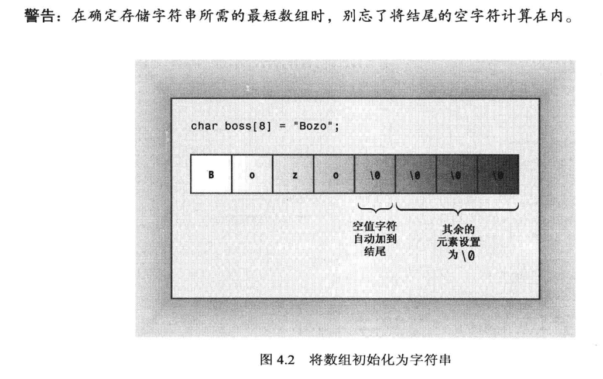
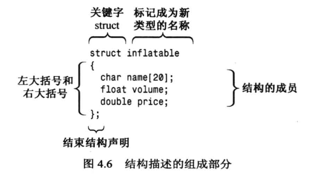
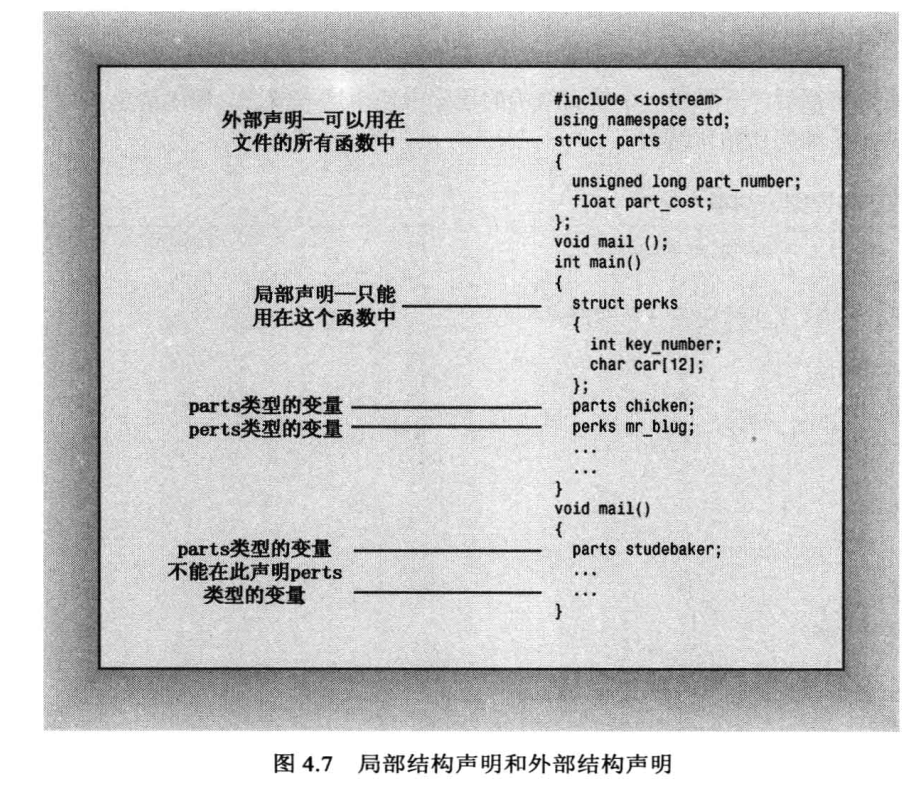
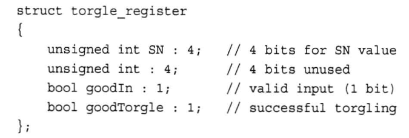

# 复合类型
## 数组array
- 存储相同类型的值
- 声明指出每个元素值类型，数组名和数组中元素数(必须为编译时已知整型常数，const值，或敞亮表达式)：typeName arrayName[arraySize];
- 使用下标或索引单独访问数组元素（必须从0开始）
- 初始化
    - 初始化列表（花括号内逗号分隔, c++11时=可省略）: int yamcosts[3] = {20, 30, 5};
    - 只有定义数组时才能初始化，hand[4] = {5,6,7,8}不允许，hand = cards也不允许
    - 提供的值少于数组中元素树木则只对前面一部分初始化，其他金元素置零： long totals[500] = {0};
    - 如果初始化时方括号为空，编译器计算元素个数： short things[] = {1,5,3,8};
    - c++11如果大括号为空则所有元素被置零
    - 列表初始化禁止缩窄
- sizeof 数组名得到整个数组的字节数

## 字符串(存储在内存连续字节中的一系列字符)
- c-style string
    - 只有结尾写作空字符\0的char数组才是字符串
    - 双引号括起来的字符串常量自动包含末尾空字符： char bird[] = "Mr. Cheeps";
    - char数组需要够大来存储结尾空字符
    - c++允许拼接字符串字面值，即将两个双引号括起来的字符串合并为一个：cout << "I'd give my right arm to be" " a great violinist. \n";
    - 列表初始化char first_data[]{"The Elegant Plate"};

- cin
    - 使用空白（空格、制表符和换行符）来确定字符串的结束位置
    - cin会把读取的字符串放到数组中并自动在结尾添加空字符
    - 无法避免读取的字符串比数组长
    - cin.getline(数组名，字符数+1)，使用更简单，以换行符结尾但保存时用空字符换行符
    - cin.get(name, ArSize), 检查错误更方便，调用后换行符会留在队列中，需要使用cin.get()读取下一个字符为读取下一行做准备
    - get()读取空行后将设置失效位，需要使用cin.clear()恢复
    - 输入字符串比分配空间长，getline()和get()会把剩下字符留在队列中，getline()会设置失效位
    - cin读取数字会把换行符留在队列中，
## String
- 程序可以自动处理string的大小
- 列表初始化： string third_data {"Hank's Fine Eats"};
- 数组不可以赋值给另一个数组，但是string可以赋值给另一个string
- 可以使用+, +=合并字符串
- 在没有string前就有了istream，因此istream中没有处理string对象的方法，但是string对象使用友元函数实现cin >> str;
- c++11新增raw字符串，字符表示的就是自己，无需使用\。原始字符串使用前缀R标识，使用"(和)"用作界定符: cout << R"(Jim "King" Tutt uses "\n" instead of endl.)" << '\n';
- raw字符串可以再在"和(间添加任意数量的出空格，左括号，右括号，斜杠和控制字符外的基本字符，同理结尾"和)之间也需要添加，这样就可以在原始字符串中使用"(了

## 结构
- 用户定义类型，结构钢声明定义了其数据属性。定义类型后可以创建结构变量
- 相比于c，声明结构变量时可以不用关键字struct: ~~struct~~ inflatable vincent;
- 可通过成员运算法（.）访问各个成员
- c++提倡使用外部结构声明
- 结构体变量初始化也是用,分隔变量，用{}把值括起： inflatable duck {"Daphne", 0.12,9.98};
- 结构体允许使用=进行成员赋值, 即使结构体成员有数组：inflatable bouquet {}; inflatable choice; choice = bouquet;
- c++结构还允许有成员函数
- 可以创建元素为结构的数组： inflatable gifts[100];
- 结构中的位字段，方便对应硬件寄存器，字段类型应为整型或美剧，接下来是冒号，接下来是制定使用位数的数字

