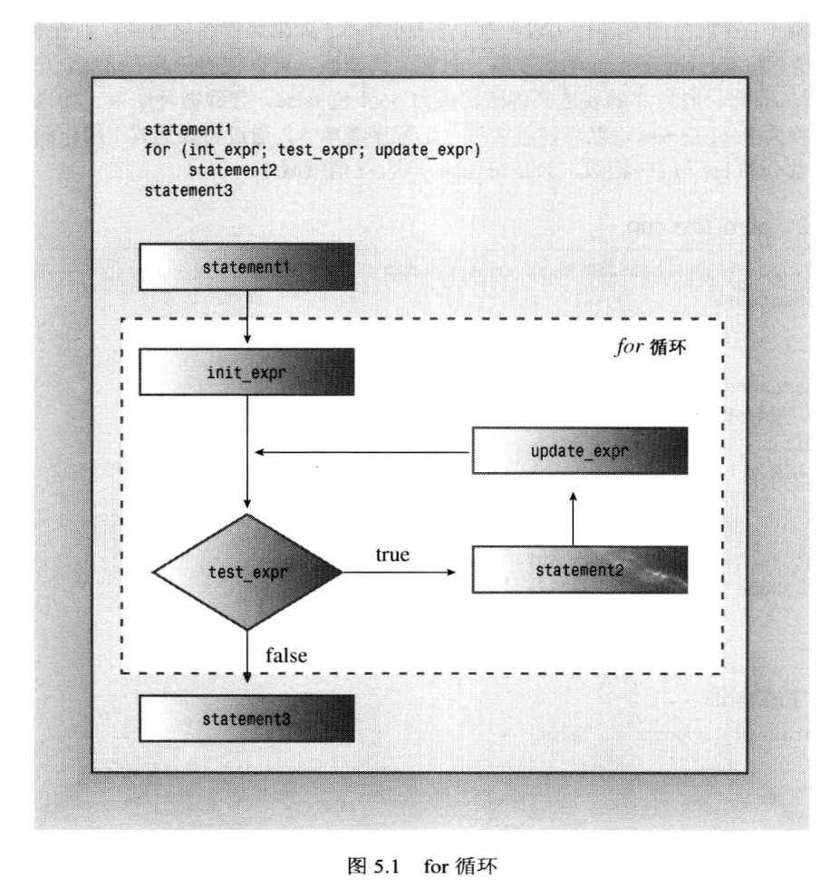
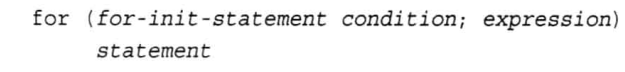
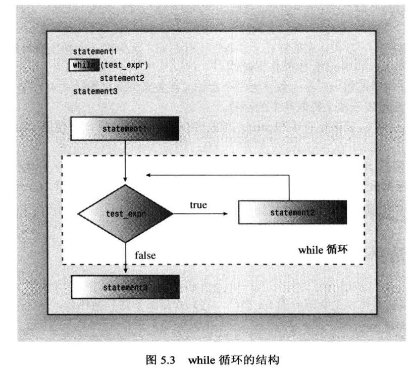
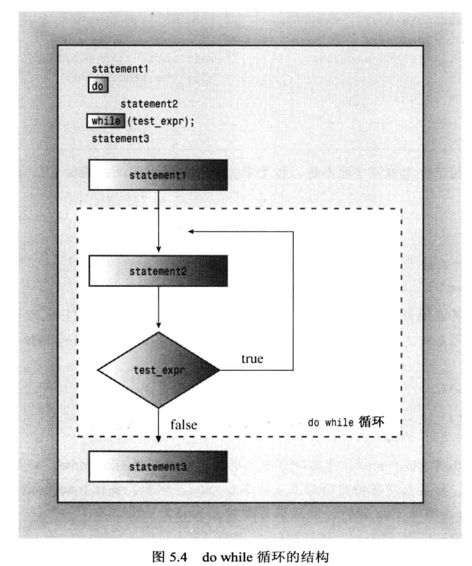

# 循环和关系表达式
- 指定循环终止的条件
- 首次测试前初始化条件
- 条件被再次测试前更新条件

## 表达式
- 任何值或值与运算符的组合都是表达式，例如10是值为10的表达式，28*20是值为560的表达式
- 每个c++表达式都有值
- 赋值表达式的值定义为左侧成员的值，x=20的值为20
- 关系表达式的值将被判定为bool值ture或false
- 表达式加分号就变成表达式语句

## 副作用和顺序点
- 副作用(side effect)是在计算表达式时对某些东西（如存储在变量中的值）进行了修改
- 顺序点事程序执行过程的一个点，进入下一步之前将确保对副作用进行了评估
- c++中，分号就是一个顺序点，在处理下一条语句前，赋值运算符、递增运算符和递减运算符执行的修改必须完成
- 任何完整表达式末尾都是一个顺序点
- 完整表达式即不是另一个更大表达式子表达式

## cin进一步解释
- cin >> ch; 忽略空格，换行符和制表符
- cin.get(ch); 读取下一个输入字符，不管字符是什么，并保存在ch中
- ch = cin.get(); 返回下一个输入字符，包括空格、换行符和制表符
- 文件尾条件（EPF），键盘输入时，UNIX为CTRL+D，Windows为CTRL+Z
- 检测到EOF后，cin将两位（eofbit和failbit）都置为1，可用cin.eof()和cin.fail()读取，两个都需要已经读到EOF后才能更新，可以while(!cin.fail())
- istream可以将istream对象转换为bool值，因此可以while(cin)

## 类型别名
- 预处理器： 
## for循环
- 入口条件循环
- 省略测试条件，认为条件为true
- 可使用初始化语句声明一个局部变量, 句法规则见for的第二幅图
- 检测不等比检测相等好，
- ++和--，放到操作数后面，后自加和后自减，先用当前值再加1，一条语句对一个值只用一次，否则会失控
- 完整表达式
- 基于范围的for循环

## while循环
- 入口条件循环
- 推荐无法预先知道循环将执行的次数

## do while循环
- 出口条件循环

## 二维数组
- 
