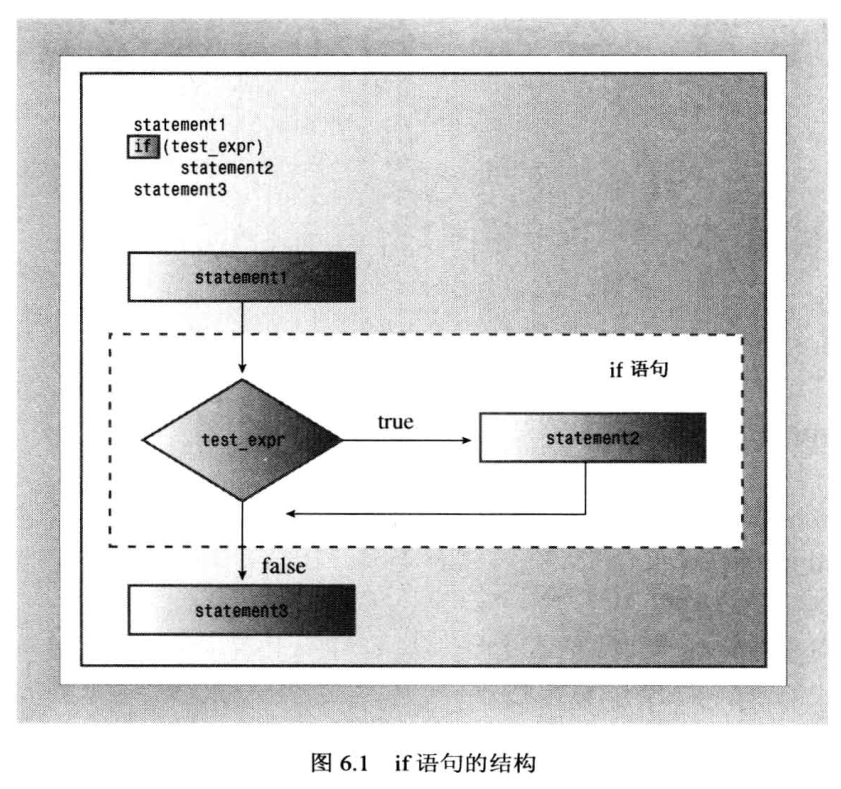
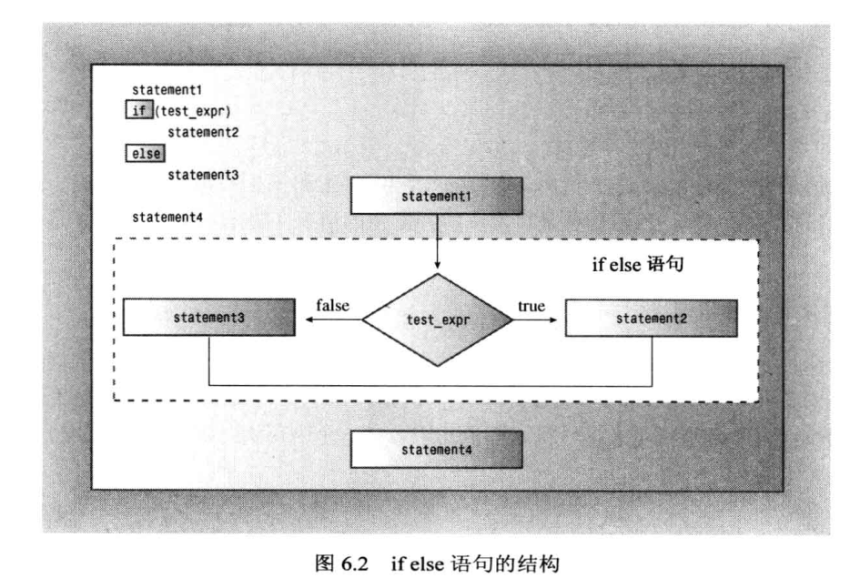
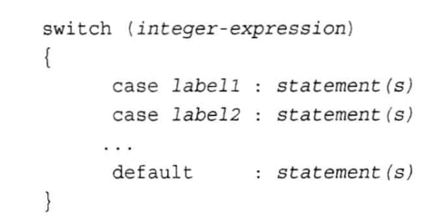
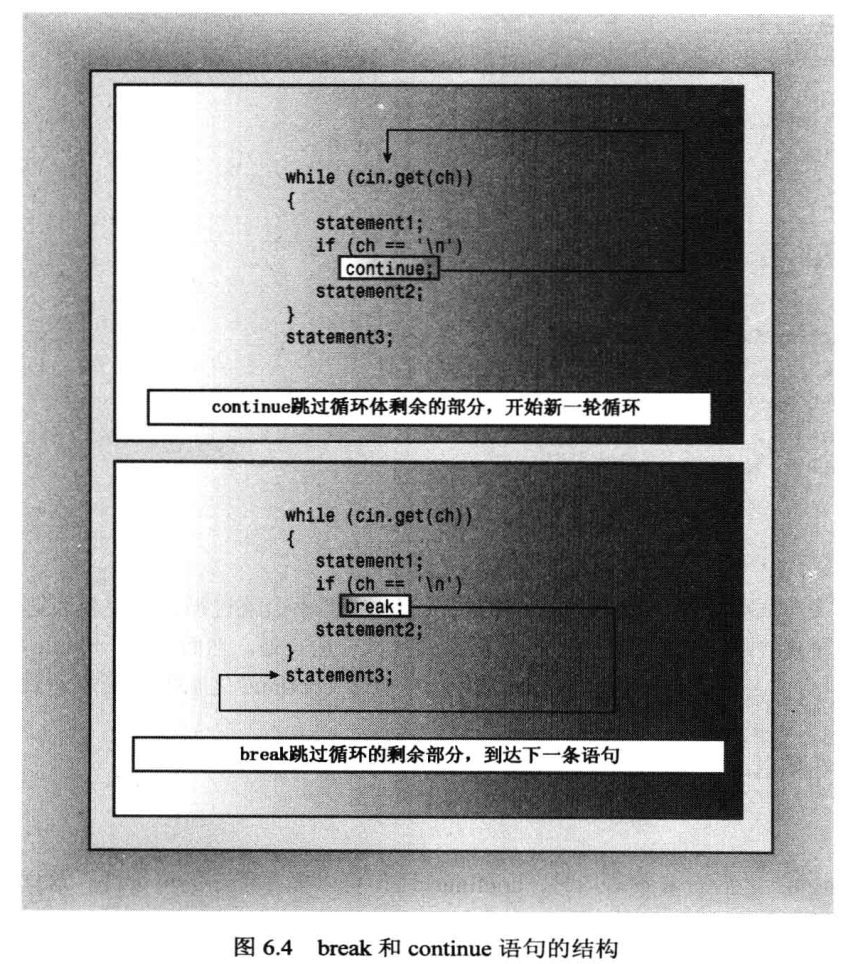

# 分支语句和逻辑运算符

## if语句

## ifelse语句

## 逻辑表达式
- 逻辑运算符从左向右结合
- AND的优先级比OR更高

## 字符函数库cctype
- 在头文件cctype中定义
- 检查字符类型P179：是否字母isalphs(ch), 检查标点ispunct(ch)

## ？：条件运算符
- 唯一需要3个操作数的运算符
- 条件运算符生成一个表达式，是一个值，可将其赋值给变量或放到更大表达式中

## switch语句
- switch和case后标签均为整型表达式，可以是int或char或枚举量
- case标签只是行标签，不是选项的界限，没有break会依次执行后面的所有语句
- 如果既可以使用If else if语句，也可以使用switch语句，当选项不小于3个时，应使用switch语句

## break和continue语句

