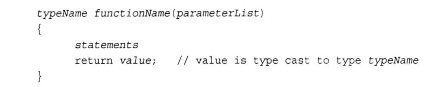
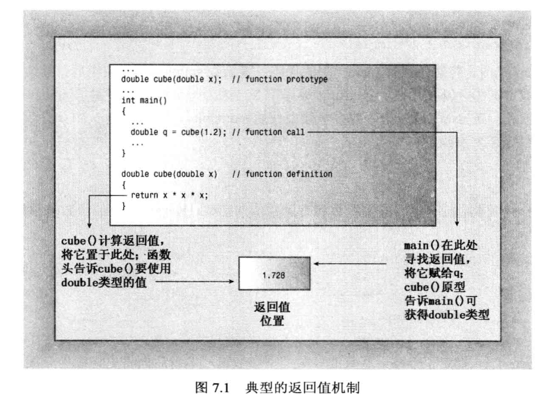
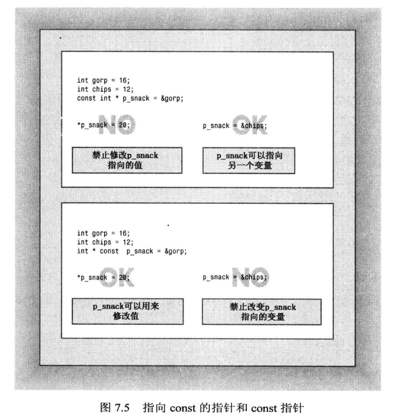
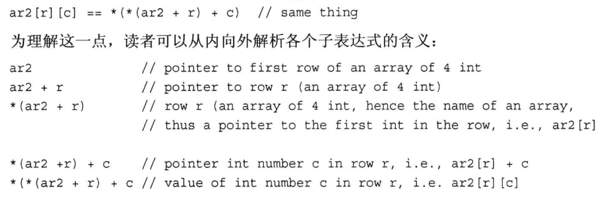
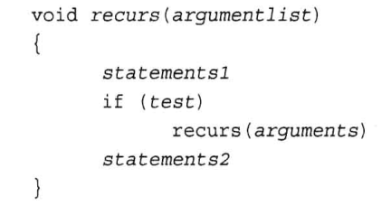
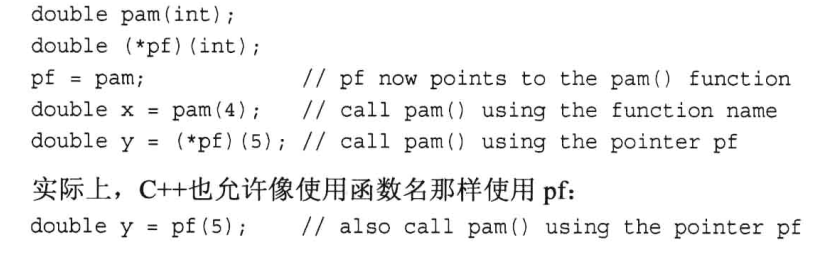
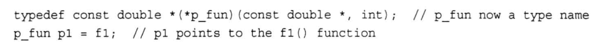

# 函数
- 提供函数定义
- 提供函数原型
- 调用函数

## 基本知识
- 有返回值的函数必须使用返回语句
- 函数不能直接返回数组，但可以是其他任何类型，可以将数组作为结构或对象组成部分来返回
- 原型描述了函数到编译器的接口
- 用于接收传递值的变量被称为形参(parameter)
- 传递给函数的值被称为实参(argument)
- 当且仅当用于函数头或函数原型中，int *arr和int arr[]的含义是相同的
## const
- const变量的地址赋给指向const变量的指针: const float g_earth = 9.80; const float * pe = &g_earth;
- 禁止将const变量的地址赋给非指向const变量的指针，除非使用const_cast强制类型转换
- 只有一层间接关系是（如指针指向基本数据类型），才可以将非const地址或指针赋给const指针

## 传递二维数组
- 函数原型int sum(int (*ar2)[4], int size); 括号必不可少，int *ar2[4]是4个指向int的指针组成的数组，而不是一个指向由4个int组成的数组的指针，函数参数也不能是数组
- 另一种格式int sum(int ar2[][4], int size);

## 传递字符串
- 类型都是char*，使用空值字符\0结束字符串
## 传递结构
- 可以按值传递结构，结构较小时使用
- 传递指针
- 按引用传递（第8章介绍）

## 传递string
- string对象

## 传递array对象
- array可以存储类对象

## 递归
- 自己调用自己
- 通常将递归调用放在if语句中

## 函数指针
- 函数的地址是存储其机器语言代码的内存的开始地址
- 获取函数地址：只要使用函数名（后面不跟参数，包括括号）即可
- 声明指向函数的指针时，也必须指定指针指向的函数类型，也即指定函数的返回类型和函数的特征标

