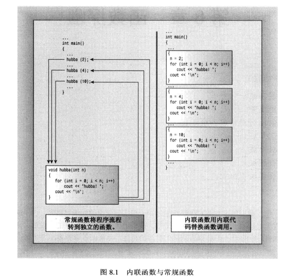
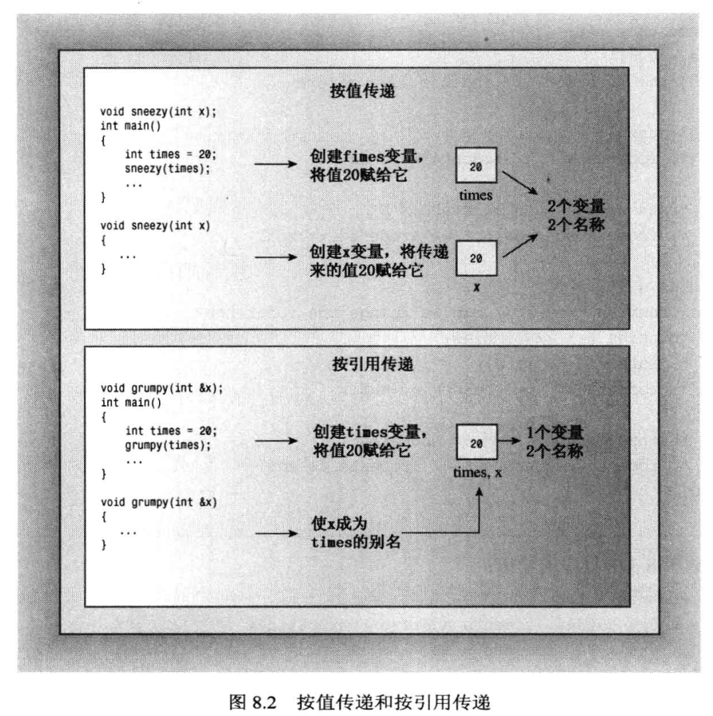
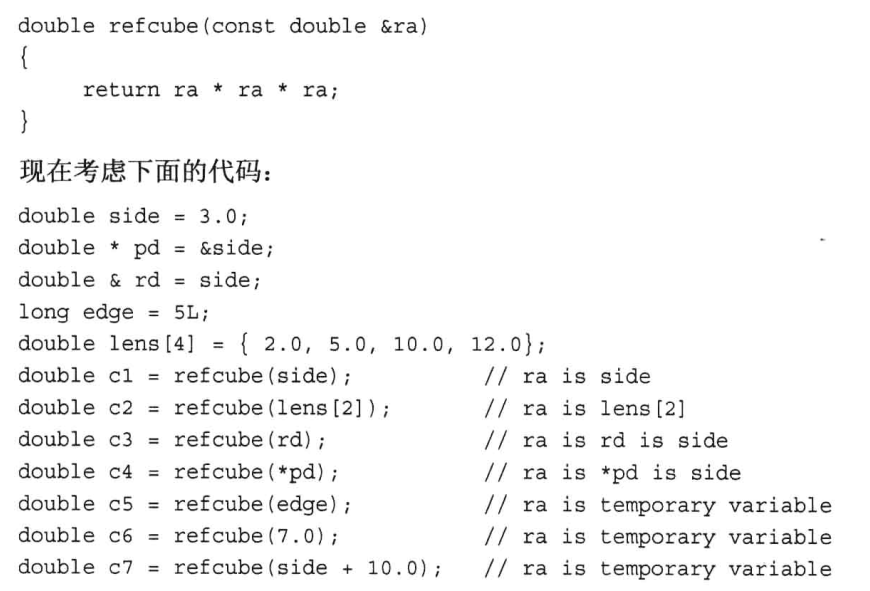
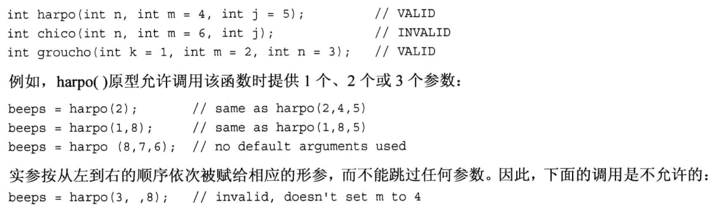
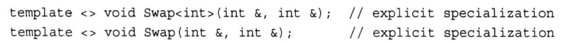
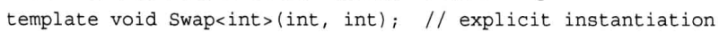

# 函数探幽

## 内联函数
- 和常规函数区别在于编译器如何将他们组合到程序中
- 编译器将内联函数的代码替换函数调用
- 运行速度快，但是占内存
- 在函数声明或定义前加关键字inline
- 通常省略原型，将定义（包括函数头和函数代码）放在本应提供原型的地方

## 按引用传递变量
- 引用是已定义的变量的别名，主要用作函数形参
- 必须在声明引用时将其初始化
- 引用用作形参，函数调用使用实参初始化形参
- 如果形参是const引用变量，以下两种情况会生成临时变量（形参称为临时变量的引用）：
    - 如果实参类型正确，但不是左值（可被引用数据对象如变量，数组元素，结构成员，引用和解除引用的指针）
    - 实参类型不正确，但能转换成正确的类型
    - 为了避免修改实参的意图无法实现
- 字面值是右值，常规函数返回值是右值
- 基类引用可以指向派生类对象，无需强制类型转化，因此定义基类引用作为参数的函数，可将基类和派生类对象作为参数

## 默认参数值
- 函数调用中省略了实参时自动使用的值
- 形参必须从右向左添加默认值
- 实参必须从左导游一次赋给形参，不允许跳参数

## 函数重载
- 多个重名的函数，使用上下文来确认要使用的重载函数版本
- 重载要求特征标（即参数列表）不同
- 编译器将类型引用和类型本身视为同一个特征标
- const和非const视为不同特征标
## 模板函数
- 关键字typename和class等价
- 模板可重载，同样要求特征标不同
- 显式具体化（explicit specification）
    - 对于给定函数名，可以有非模版函数、模版函数和显式具体化模版函数及其重载版本
    - 显式具体化的原型和定义应以template<>打头，并通过名称来指出类型
    - 编译器选择时，非模版函数>显式具体化>常规模版
    - （隐式）实例化：编译器使用模版为特定类型生成函数定义时，得到模版实例（implicit instantiation）
    - （显式）实例化：命令编译器创建特定实例（explicit instantiation）

- P289 编译器如何选择对应函数
