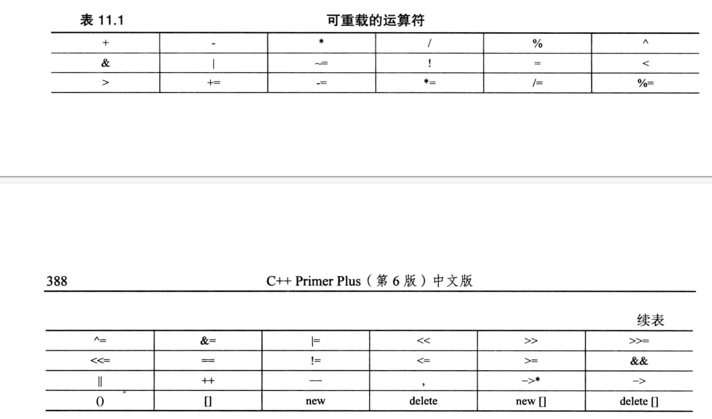

# 使用类

## 运算符重载
- 运算符函数： operator*op*(*argument-list*),例如operator+()重载+运算符
- 编译器检查操作数，使用响应运算符函数替换上述运算符。例如district2,sid, sara是Salesperson类对象，district2 = sid + sara;编译器替换为district2 = sid.operator+(sara);
- 运算符重载限制
    - 重载后的运算符必须至少有一个操作数是用户定义的类型，防止用户为标准类型重载运算符
    - 不能违反运算符原来的句法规则，不能修改运算符的优先级
    - 不能创建新运算符
    - 有些运算符不能重载，赋值运算符（=），函数调用运算符（（）），下标运算符（[]），指针访问运算符（->）只能通过成员函数重载

## 友元

## 类的自动类型转换
